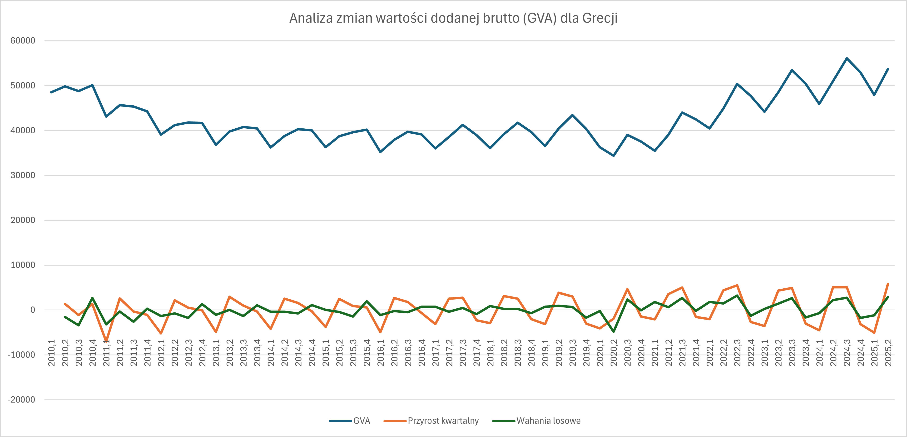

# Analiza wartości dodanej brutto (GVA) dla Grecji - Dekompozycja szeregu czasowego

### 📋 Opis

Analiza dekompozycji szeregu czasowego wartości dodanej brutto (Gross Value Added - GVA) dla Grecji. Obejmuje usunięcie trendu i sezonowości z danych kwartalnych oraz identyfikację składnika losowego.

Wykorzystano dane z [Eurostat](https://ec.europa.eu/eurostat/web/national-accounts/database) dla danych kwartalnych wartości dodanej brutto (GVA) dla Grecji w okresie od 2010 do 2025 roku.

Zrobiono to zarówno w **Excelu**, jak i w **R**.

### 🔧 Metodologia

1. Usunięcie trendu za pomocą metody pierwszej różnicy
```
d_GVA(t) = GVA(t) - GVA(t-1)
```
Pierwsza różnica eliminuje trend liniowy i pokazuje bezwzględną zmianę wartości GVA między kolejnymi kwartałami.

2. Usunięcie sezonowości

- Dla każdego kwartału (Q1-Q4) obliczono średnie odchylenia od trendu
- Dane surowe skorygowano o wskaźniki sezonowe
- Otrzymano dane "oczyszczone"

3. Wahania przypadkowe

    Po usunięciu trendu i sezonowości pozostaje składnik losowy, reprezentujący nieprzewidywalne wahania niewyjaśnione przez pozostałe komponenty. 

### 📊 Struktura danych

| Kolumna | Nazwa | Opis |
|----------|--------|------|
| A | Daty | Kwartały (format: YYYY.Q) |
| B | GVA | Wartość dodana brutto |
| C | Przyrost kwartalny | Pierwsza różnica GVA (usunięcie trendu) |
| D | Wahania losowe | Składnik nieregularny po dekompozycji |

### 📈 Wizualizacja



### 🔍 Objaśnienia

**GVA** - miara tego, ile wartości wytworzyła gospodarka danego kraju w określonym okresie. Jest to suma wszystkich dóbr i usług wyprodukowanych przez przedsiębiorstwa i instytucje, pomniejszona o koszty zużytych surowców i materiałów.

**Przyrost kwartalny** - GVA po usunięciu trendu

**Wahania losowe** - GVA po usunięciu trendu i sezonowości