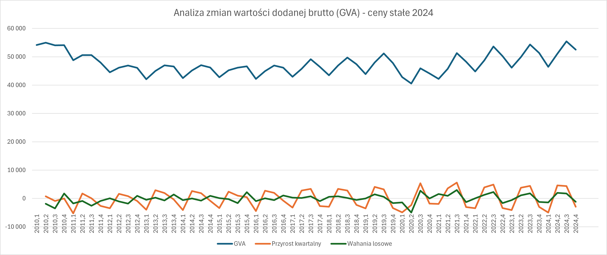

# Analiza wartości dodanej brutto (GVA) dla Grecji - Konwersja cen nominalnych na ceny stałe

### 📋 Opis
Analiza procesu konwersji wartości dodanej brutto (Gross Value Added - GVA) z cen nominalnych (bieżących) na ceny stałe dla Grecji. Celem jest umożliwienie porównania rzeczywistego wzrostu gospodarczego poprzez wyeliminowanie wpływu inflacji.

**Ceny nominalne (bieżące)** - wartości wyrażone w cenach obowiązujących w danym momencie czasu. Zawierają efekt inflacji, przez co wartości z różnych lat nie są bezpośrednio porównywalne.

**Ceny stałe** - wartości skorygowane o inflację i przeliczone na ceny z wybranego roku bazowego. Eliminują wpływ wzrostu cen, dzięki czemu pokazują rzeczywisty wzrost gospodarczy i pozwalają porównywać dane z różnych okresów.

Wykorzystano dane z [Eurostat](https://ec.europa.eu/eurostat/web/national-accounts/database) dla danych kwartalnych wartości dodanej brutto (GVA) dla Grecji w okresie od 1995 do 2025 roku, a także roczne dane GVA w cenach stałych roku 2015 i 2024. 

### 🔧 Metodologia
1. Obliczenie indeksów łańcuchowych

    Indeks łańcuchowy pokazuje dynamikę zmian między kolejnymi okresami:
    ```
    Indeks_łańcuchowy(t) = GVA(t) / GVA(t-1)
    ```
    - Wartość > 1 oznacza wzrost względem poprzedniego okresu
    - Wartość < 1 oznacza spadek
    - Wartość = 1 oznacza brak zmian

2. Agregacja danych kwartalnych do rocznych

    Z danych kwartalnych obliczono roczne wartości GVA poprzez sumowanie czterech kwartałów dla każdego roku. Otrzymano roczne wartości w cenach nominalnych.

3. Obliczenie rocznych indeksów łańcuchowych

    Dla wartości rocznych obliczono dynamikę rok do roku:
    ```
    ind_łańcuchowy_roczny = GVA_roczne(rok) / GVA_roczne(rok-1)
    ```

4. Konwersja na ceny stałe roku 2015
    Proces konwersji wykorzystuje roczną wartość GVA z Eurostatu (w cenach stałych) w 2015 dla Grecji oraz indeksy łańcuchowe kwartalne z danych nominalnych.

    Za pomocą narzędzia **Solver w Excelu** wyznaczono wartość GVA dla pierwszego kwartału roku 2015. Solver automatycznie dobiera tę wartość tak, aby suma czterech kwartałów była równa rocznej wartości z Eurostatu. Po ustaleniu tej wartości pozostałe kwartały obliczono poprzez:
    ```
    GVA_ceny_stałe(t) = GVA_ceny_stałe(t-1) × ind_łańcuchowy(t)
    ```

5. Konwersja na ceny stałe roku 2024
    Proces identyczny jak dla roku 2015, z wykorzystaniem danych Eurostatu w cenach stałych w 2024 dla Grecji.

    Po ustaleniu wartości GVA dla pierwszego kwartału roku 2024, dla poprzednich kwartałów obliczono to w następujący sposób:
    ```
    GVA_ceny_stałe(t-1) = GVA_ceny_stałe(t) / ind_łańcuchowy(t)
    ```

6. Dekompozycja szeregu czasowego dla cen stałych 2024
    Dla obliczonych cen stałych z roku 2024 dla Grecji wyodrębniono te z lat 2010 - 2024 i zrobiono dla nich dekompozycję szeregu czasowego poprzez usunięcie trendu i sezonowości - to samo co w [Laboratorium 1](../lab01/), czego efektem jest poniższy wykres.

### 📈 Wizualizacja


### 🔍 Objaśnienia

**GVA** - miara tego, ile wartości wytworzyła gospodarka danego kraju w określonym okresie. Jest to suma wszystkich dóbr i usług wyprodukowanych przez przedsiębiorstwa i instytucje, pomniejszona o koszty zużytych surowców i materiałów.

**Przyrost kwartalny** - GVA dla cen stałych w 2024 roku po usunięciu trendu

**Wahania losowe** - GVA dla cen stałych w 2024 roku po usunięciu trendu i sezonowości