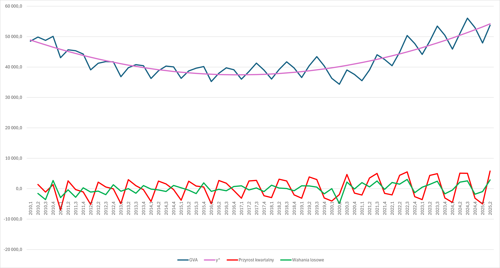
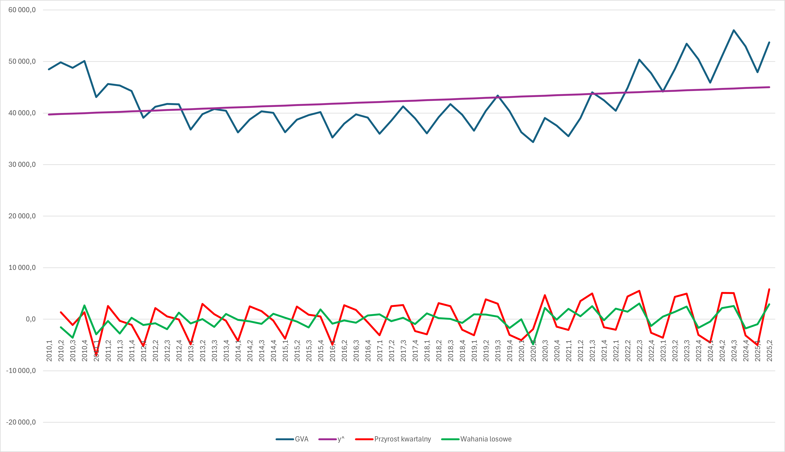

# Analiza wartości dodanej brutto (GVA) dla Grecji - Modele trendu dla cen bieżących (nominalnych)

### 📋 Opis
Analiza szeregu czasowego wartości dodanej brutto (Gross Value Added - GVA) dla Grecji w latach 2010-2025, wyrażonej w cenach nominalnych. Celem jest porównanie modeli trendu - liniowego, potęgowego, wykładniczego, kwadratowego i logistycznego.

## 1. Trend liniowy

### Użyteczne wzory:

#### 1° Specyfikacja modelu 
$$y_t = \beta_0 + \beta_1 \cdot t + \xi_t$$

gdzie:
- $y_t$ - wartość GVA w okresie t
- $t$ - zmienna czasowa (t = 1, 2, 3, ..., T), np. kolejne kwartały
- $\beta_0$ - wyraz wolny
- $\beta_1$ - parametr nachylenia (przyrost absolutny GVA na jednostkę czasu)
- $\xi_t$ - składnik losowy

#### 2° Estymowana wartość zmiennej

Wzór na przewidywaną wartość na podstawie dopasowanego modelu.

$$\hat{y}_t = \hat{\beta}_0 + \hat{\beta}_1 t$$

#### 3° Reszty i wariancja reszt

Reszta to różnica między rzeczywistą wartością a przewidywaną:

$$\hat{\varepsilon}_t = y_t - \hat{y}_t$$

Wariancja reszt:

$$\hat{\sigma}^2 = \frac{\sum (y_t - \hat{y}_t)^2}{T - k - 1}$$

gdzie:
- 𝑇 - liczba obserwacji
- 𝑘 - liczba zmiennych objaśniających (tu 1, bo tylko czas)
- 𝑇 − 𝑘 − 1 - stopnie swobody estymacji

#### 4° Szybkość wzrostu

Wskazuje o ile zmienia się wartość zmiennej, gdy czas zmienia się o jedną jednostkę (np. kwartał). Jest to absolutna zmiana, wyrażona w takich samych jednostkach co **y** (np. złotówki, sztuki).

$$\frac{dy_t}{dt} = y'_t = \beta_1$$

#### 5° Tempo wzrostu

Wskazuje jak duża jest zmiana w stosunku do aktualnego poziomu zmiennej. Jest to relatywna zmiana, mówi jak szybko rośnie zmienna procentowo.

$$\frac{\frac{dy_t}{dt}}{y_t} = \frac{\beta_1}{y_t}$$

### 🔧 Metodologia

#### 1. Utworzenie macierzy $\mathbf{X}$

$$\mathbf{X} = \begin{bmatrix} 1 & x_1 \\ 1 & x_2 \\ \vdots & \vdots \\ 1 & x_n \end{bmatrix}$$

* **kolumna 1** – same jedynki $\rightarrow$ odpowiada $\beta_0$ (wyraz wolny),
* **kolumna 2** – wartości zmiennej $x_i, odpowiada numerom kolejnych kwartałów w latach 2010-2025.

#### 2. Macierz $\mathbf{X}^T\mathbf{X}$

* $\mathbf{X}^T$ to **transpozycja macierzy** $\mathbf{X}$, czyli zamiana wierszy na kolumny:

$$\mathbf{X}^T = \begin{bmatrix} 1 & 1 & \cdots & 1 \\ x_1 & x_2 & \cdots & x_n \end{bmatrix}$$

* Mnożenie $\mathbf{X}^T\mathbf{X}$:

$$\mathbf{X}^T\mathbf{X} = \begin{bmatrix} 1 & 1 & \cdots & 1 \\ x_1 & x_2 & \cdots & x_n \end{bmatrix} \begin{bmatrix} 1 & x_1 \\ 1 & x_2 \\ \vdots & \vdots \\ 1 & x_n \end{bmatrix} = \begin{bmatrix} \sum 1 & \sum x_i \\ \sum x_i & \sum x_i^2 \end{bmatrix} = \begin{bmatrix} n & \sum x_i \\ \sum x_i & \sum x_i^2 \end{bmatrix}$$

#### 3. Macierz $\mathbf{X}^T\mathbf{y}$

* $\mathbf{y}$ to **wektor obserwacji**, w tym przypadku jest to wektor wartości GVA w poszczególnych kwartałach:

$$\mathbf{y} = \begin{bmatrix} y_1 \\ y_2 \\ \vdots \\ y_n \end{bmatrix}$$

* Mnożenie $\mathbf{X}^T\mathbf{y}$:

$$\mathbf{X}^T\mathbf{y} = \begin{bmatrix} 1 & 1 & \cdots & 1 \\ x_1 & x_2 & \cdots & x_n \end{bmatrix} \begin{bmatrix} y_1 \\ y_2 \\ \vdots \\ y_n \end{bmatrix} = \begin{bmatrix} \sum y_i \\ \sum x_iy_i \end{bmatrix}$$

#### 4. Oszacowanie współczynników $\beta_0$ oraz $\beta_1$

$$\begin{bmatrix} \hat{\beta}_0 \\ \hat{\beta}_1 \end{bmatrix} = (\mathbf{X}^T\mathbf{X})^{-1}\mathbf{X}^T\mathbf{y}$$

#### 5. Oszacowanie $\hat{y_t}$, czyli trendu

$$\hat{y}_t = \hat{\beta}_0 + \hat{\beta}_1 t$$

#### 6. Obliczenie wariancji

$$\hat{\sigma}^2 = \frac{\sum (y_t - \hat{y}_t)^2}{T - k - 1}$$

gdzie:
- $y_t$ - rzeczywista wartość GVA w cenach stałych
- $\hat{y_t}$ - trend
- 𝑇 − 𝑘 − 1 - w tym przypadku to: 32 - 1 - 1

#### 7. Obliczenie szybkości i tempa wzrostu

$$\frac{dy_t}{dt} = y'_t = \beta_1$$

Szybkość wzrostu jest to po prostu uzyskana z wcześniejszych obliczeń wartość współczynnika $\beta_1$.

$$\frac{\frac{dy_t}{dt}}{y_t} = \frac{\beta_1}{y_t}$$

Tempo wzrostu jest to po prostu szybkość wzrostu podzielona przez średnią wartość GVA.

### 📝 Wyniki

- Wariancja: $\hat{\sigma}^2 = 26294614$ 
- $\hat{\beta_0} \approx 39543.87$
- $\hat{\beta_1} \approx 87.056$

Przeciętnie rzecz biorąc, z kwartału na kwartał wartość dodana brutto (GVA) dla Grecji rosła o 87.06 mln euro.

Przeciętnie rzecz biorąc, z kwartału na kwartał wartość dodana brutto (GVA) dla Grecji rosła o $0.21 \%$.

### 📈 Wizualizacja

## 2. Trend potęgowy

### Użyteczne wzory:

#### 1° Specyfikacja modelu

$$y_t = e^{\beta_0} t^{\beta_1} e^{\xi_t}$$

#### 2° Postać logarytmiczno-liniowa

$$\ln y_t = \beta_0 + \beta_1 \ln t + \xi_t$$

#### 3° Szybkość wzrostu

$$\frac{dy_t}{dt} = e^{\beta_0} \beta_1 t^{\beta_1 - 1} e^{\xi_t} = \beta_1 \underbrace{e^{\beta_0} t^{\beta_1} e^{\xi_t}}_{y_t} t^{-1} = \beta_1 \frac{y_t}{t}$$

więc ostatecznie:

$$\frac{dy_t}{dt} = y'_t = \beta_1 \frac{y_t}{t}$$

#### 4° Tempo wzrostu

$$\frac{\frac{dy_t}{dt}}{y_t} = \frac{\beta_1 \frac{y_t}{t}}{y_t} = \frac{\beta_1}{t}$$

### 🔧 Metodologia

#### 1. Obliczenie dla każdej wartości $ln(gva)$ oraz $ln(t)$

#### 2. Wykorzystanie narzędzia 'Analiza Danych' w Excelu 

Wybrano: Dane -> Analiza danych -> Regresja

Jako zakres wejściowy Y wybrano całą kolumnę z obliczonymi $ln(gva)$.

Jako zakres wejściowy X wybrano całą kolumnę z obliczonymi $ln(t)$.

Otrzymano różne statystyki, w tym również współczynniki $\beta_0$ oraz $\beta_1$, które potem wykorzystano.

#### 3. Oszacowanie $\hat{y_t}$, czyli trendu

$$\hat{y_t} = e^{\hat{\beta_0}} t^{\hat{\beta_1}}$$

#### 4. Obliczenie szybkości i tempa wzrostu

* Szybkość wzrostu

$$\frac{dy_t}{dt} = y'_t = \hat{\beta_1} \frac{y_t}{t}$$

* Tempo wzrostu

$$\frac{\frac{dy_t}{dt}}{y_t} = \frac{\hat{\beta_1}}{t}$$

gdzie:
- $y_t$ - wartość ostatniej obserwacji GVA
- t = 62 - liczba obserwacji

### 📝 Wyniki

- Wariancja: $\hat{\sigma}^2 = 28909897$ 
- $\hat{\beta_0} \approx 10.66$
- $\hat{\beta_1} \approx -0.0029$

Przeciętnie rzecz biorąc, z kwartału na kwartał, wartość dodana brutto (GVA) dla Grecji malała o 2.496 mln euro.

Przeciętnie rzecz biorąc, z kwartału na kwartał, wartość dodana brutto (GVA) dla Grecji malała o $0.046 \%$.

### 📈 Wizualizacja

## 3. Trend wykładniczy

### Użyteczne wzory:

#### 1° Specyfikacja modelu

$$y_t = e^{\beta_0 + \beta_1 t + \xi_t}$$

#### 2° Postać logarytmiczno-liniowa

$$\ln y_t = \beta_0 + \beta_1 t + \xi_t$$

#### 3° Szybkość wzrostu

$$\frac{dy_t}{dt} = \underbrace{e^{\beta_0 + \beta_1 t + \xi_t}}_{y_t} \beta_1 = \beta_1 y_t$$

#### 4° Tempo wzrostu

$$\frac{\frac{dy_t}{dt}}{y_t} = \frac{\beta_1 y_t}{y_t} = \beta_1$$

### 🔧 Metodologia

#### 1. Obliczenie dla każdej wartości $ln(gva)$ oraz $ln(t)$

#### 2. Wykorzystanie narzędzia 'Analiza Danych' w Excelu 

Wybrano: Dane -> Analiza danych -> Regresja

Jako zakres wejściowy Y wybrano całą kolumnę z obliczonymi $ln(gva)$.

Jako zakres wejściowy X wybrano całą kolumnę z wartościami $t$.

Otrzymano różne statystyki, w tym również współczynniki $\beta_0$ oraz $\beta_1$, które potem wykorzystano.

#### 3. Oszacowanie $\hat{y_t}$, czyli trendu

$$\hat{y_t} = e^{\hat{\beta_0} + \hat{\beta_1} t}$$

#### 4. Obliczenie szybkości i tempa wzrostu

* Szybkość wzrostu

$$\frac{dy_t}{dt} = \hat{\beta_1} y_t$$

* Tempo wzrostu

$$\frac{\frac{dy_t}{dt}}{y_t} = \hat{\beta_1}$$

gdzie:
- $y_t$ - wartość ostatniej obserwacji GVA

### 📝 Wyniki

- Wariancja: $\hat{\sigma}^2 = 26220950$ 
- $\hat{\beta_0} \approx 10.586$
- $\hat{\beta_1} \approx 0.0019$

Przeciętnie rzecz biorąc, z kwartału na kwartał, wartość dodana brutto (GVA) dla Grecji rosła o 100.07 mln euro.

Przeciętnie rzecz biorąc, z kwartału na kwartał, wartość dodana brutto (GVA) dla Grecji rosła o $0.19 \%$.

### 📈 Wizualizacja

## 4. Trend kwadratowy

### Użyteczne wzory:

#### 1° Specyfikacja modelu 
$$y_t = \beta_0 + \beta_1 \cdot t + \beta_2 \cdot t^2 + \xi_t$$

gdzie:
- $y_t$ - wartość GVA w okresie t
- $t$ - zmienna czasowa (t = 1, 2, 3, ..., T), np. kolejne kwartały
- $\beta_0$ - wyraz wolny
- $\beta_1$ - liniowa część trendu
- $\beta_2$ - parametr krzywizny (mówi, czy trend przyspiesza czy hamuje)
- $\xi_t$ - składnik losowy

#### 2° Estymowana wartość zmiennej

Wzór na przewidywaną wartość na podstawie dopasowanego modelu.

$$\hat{y}_t = \hat{\beta}_0 + \hat{\beta}_1 t + \hat{\beta}_2 t^2$$

#### 3° Reszty i wariancja reszt

Reszta to różnica między rzeczywistą wartością a przewidywaną:

$$\hat{\varepsilon}_t = y_t - \hat{y}_t$$

Wariancja reszt:

$$\hat{\sigma}^2 = \frac{\sum (y_t - \hat{y}_t)^2}{T - k - 1}$$

gdzie:
- 𝑇 - liczba obserwacji
- 𝑘 = 2 - liczba zmiennych objaśniających ($t$ oraz $t^2$)
- 𝑇 − 𝑘 − 1 - stopnie swobody estymacji

#### 4° Szybkość wzrostu

Wskazuje o ile zmienia się wartość zmiennej, gdy czas zmienia się o jedną jednostkę (np. kwartał). Jest to absolutna zmiana, wyrażona w takich samych jednostkach co **y** (np. złotówki, sztuki).

$$\frac{dy_t}{dt} = \beta_1 + 2 \cdot \beta_2 t$$

gdzie:
- $t$ - średnia wartość z numeru obserwacji (w tym przypadku średnia z liczb: od 2 do 63)

#### 5° Tempo wzrostu

Wskazuje jak duża jest zmiana w stosunku do aktualnego poziomu zmiennej. Jest to relatywna zmiana, mówi jak szybko rośnie zmienna procentowo.

$$\frac{\frac{dy_t}{dt}}{y_t} = \frac{\beta_1 + 2 \cdot \beta_2 t}{y_t}$$

gdzie: 
- $y_t$ - średnia wartość GVA 

### 🔧 Metodologia

#### 1. Utworzenie macierzy $\mathbf{X}$

$$\mathbf{X} = \begin{bmatrix} 1 & x_1 & x_1^2 \\ 1 & x_2 & x_2^2 \\ \vdots & \vdots & \vdots \\ 1 & x_n & x_n^2 \end{bmatrix}$$

* **kolumna 1** – same jedynki $\rightarrow$ odpowiada $\beta_0$ (wyraz wolny),
* **kolumna 2** – wartości zmiennej $x_i$, odpowiada numerom kolejnych kwartałów w latach 2010-2025,
* **kolumna 3** – kwadraty wartości $x_i^2$, odpowiada składnikowi kwadratowemu trendu

#### 2. Macierz $\mathbf{X}^T\mathbf{X}$

* $\mathbf{X}^T$ to **transpozycja macierzy** $\mathbf{X}$, czyli zamiana wierszy na kolumny:

$$\mathbf{X}^T = \begin{bmatrix} 1 & 1 & \cdots & 1 \\ x_1 & x_2 & \cdots & x_n \\ x_1^2 & x_2^2 & \cdots & x_n^2 \end{bmatrix}$$

* Mnożenie $\mathbf{X}^T\mathbf{X}$:

$$\mathbf{X}^T\mathbf{X} = \begin{bmatrix} 1 & 1 & \cdots & 1 \\ x_1 & x_2 & \cdots & x_n \\ x_1^2 & x_2^2 & \cdots & x_n^2 \end{bmatrix} \begin{bmatrix} 1 & x_1 & x_1^2 \\ 1 & x_2 & x_2^2 \\ \vdots & \vdots & \vdots \\ 1 & x_n & x_n^2 \end{bmatrix} = \begin{bmatrix} n & \sum x_i & \sum x_i^2 \\ \sum x_i & \sum x_i^2 & \sum x_i^3 \\ \sum x_i^2 & \sum x_i^3 & \sum x_i^4 \end{bmatrix}$$

#### 3. Macierz $\mathbf{X}^T\mathbf{y}$

* $\mathbf{y}$ to **wektor obserwacji**, w tym przypadku jest to wektor wartości GVA w poszczególnych kwartałach:

$$\mathbf{y} = \begin{bmatrix} y_1 \\ y_2 \\ \vdots \\ y_n \end{bmatrix}$$

* Mnożenie $\mathbf{X}^T\mathbf{y}$:

$$\mathbf{X}^T\mathbf{y} = \begin{bmatrix} 1 & 1 & \cdots & 1 \\ x_1 & x_2 & \cdots & x_n \\ x_1^2 & x_2^2 & \cdots & x_n^2 \end{bmatrix} \begin{bmatrix} y_1 \\ y_2 \\ \vdots \\ y_n \end{bmatrix} = \begin{bmatrix} \sum y_i \\ \sum x_iy_i \\ \sum x_i^2y_i \end{bmatrix}$$

#### 4. Oszacowanie współczynników $\beta_0$ oraz $\beta_1$

$$\begin{bmatrix} \hat{\beta}_0 \\ \hat{\beta}_1 \\ \hat{\beta}_2 \end{bmatrix} = (\mathbf{X}^T\mathbf{X})^{-1}\mathbf{X}^T\mathbf{y}$$

#### 5. Oszacowanie $\hat{y_t}$, czyli trendu

$$\hat{y}_t = \hat{\beta}_0 + \hat{\beta}_1 t + \hat{\beta}_2 t^2$$

#### 6. Obliczenie wariancji

$$\hat{\sigma}^2 = \frac{\sum (y_t - \hat{y}_t)^2}{T - k - 1}$$

gdzie:
- $y_t$ - rzeczywista wartość GVA w cenach stałych
- $\hat{y_t}$ - trend
- $T - k - 1$ - w tym przypadku to: 62 - 2 - 1 = 59

#### 7. Obliczenie szybkości i tempa wzrostu

* Szybkość wzrostu:

$$\frac{dy_t}{dt} = \beta_1 + 2 \cdot \beta_2 t$$

* Tempo wzrostu:

$$\frac{\frac{dy_t}{dt}}{y_t} = \frac{\beta_1 + 2 \cdot \beta_2 t}{y_t}$$

### 📝 Wyniki

- Wariancja: $\hat{\sigma}^2 = 7286330$ 
- $\hat{\beta_0} \approx 50603.67$
- $\hat{\beta_1} \approx -889.69$
- $\hat{\beta_2} \approx 15.03$

Średnio rzecz biorąc, z kwartału na kwartał, GVA rosła o 87.06 mln euro, co stanowi $0.21 \%$  średniej kwartalnej GVA.

### 📈 Wizualizacja

## 5. Trend logistyczny

### Użyteczne wzory:

#### 1° Specyfikacja modelu

$$y_t = \frac{a}{1 + b \cdot e^{-c \cdot t}}$$

gdzie:
- $a > 0$
- $b \ge 1$ 
- $c > 0$

#### 2° Estymacja parametrów

$$  a \approx \max(y_t)$$

$$  b \approx \frac{a - y_1}{y_1}$$

$$  c = \frac{1}{t_3 - t_1} \cdot \ln\left( \frac{\frac{a - y_{Q3}}{y_{Q3}}}{\frac{a - y_{Q1}}{y_{Q1}}} \right)$$

gdzie:
- $y_t$ - wartość GVA,
- $y_1$ - wartość pierwszej obserwacji GVA (dla tego projektu jest to wartość GVA dla pierwszego kwartału 2010 roku),
- $t_1$ - numer obserwacji, $25 \%$ całkowitej liczby obserwacji
- $t_3$ - numer obserwacji, $75 \%$ całkowitej liczby obserwacji
- $y_{Q1}$ - obserwowana wartość GVA w momencie pierwszego kwartyla czasu (gdy obserwacja numer $t_1$)
- $y_{Q3}$ - obserwowana wartość GVA w momencie trzeciego kwartyla czasu (gdy obserwacja numer $t_3$) 

#### 3° Szybkość wzrostu

$$\frac{d y_t}{d t} = c y_t \left(1 - \frac{y_t}{a}\right)$$

#### 4° Tempo wzrostu

$$\frac{\frac{d y_t}{d t}}{y_t} = c \left(1 - \frac{y_t}{a}\right)$$

### 🔧 Metodologia

#### 1. Wyznaczenie parametrów $a$, $b$ oraz $c$

* Parametr $a$:

    $a \approx \max(y_t)$, otrzymano wartość $a \approx 56074$

* Parametr $b$:

    $b \approx \frac{a - y_1}{y_1}$, otrzymano wartość $b \approx 0.156$

* Parametr $c$:

    $c = \frac{1}{t_3 - t_1} \cdot \ln\left( \frac{\frac{a - y_{Q3}}{y_{Q3}}}{\frac{a - y_{Q1}}{y_{Q1}}} \right) = \frac{1}{47 - 16} \cdot \ln\left( \frac{\frac{56074 - 44025.3}{44025.3}}{\frac{56074 - 40443.2}{40443.2}} \right) \approx 0.01113$

#### 3. Oszacowanie $\hat{y_t}$, czyli trendu

$$\hat{y_t} = \frac{a}{1 + b \cdot e^{-c \cdot t}}$$

gdzie:
- t - numer obserwacji

#### 4. Wyznaczenie wariancji wykorzystując narzędzie 'Solver' w Excelu

Będąc na komórce, gdzie pojawia się wartość wariancji obliczonej za pomocą wzoru:

$$\hat{\sigma}^2 = \frac{\sum (y_t - \hat{y}_t)^2}{T - k - 1}$$

Wybrano narzędzie 'Solver' w celu zmiany komórek, gdzie znajdują się parametry $a$, $b$ oraz $c$ poprzez minimalizację wartości wariancji. W ten sposób model trendu będzie bardziej dopasowany do wykresu GVA. Jako wymagane ograniczenie ustawiono komórkę z parametrem $b \gt= 1$.
W ten sposób uzyskano prawidłowe wartości parametrów $a$, $b$ oraz $c$, które można wykorzystać w dalszej analizie.

#### 5. Obliczenie szybkości i tempa wzrostu

* Szybkość wzrostu

$$\frac{d y_t}{d t} = c y_t \left(1 - \frac{y_t}{a}\right)$$

* Tempo wzrostu

$$\frac{\frac{d y_t}{d t}}{y_t} = c \left(1 - \frac{y_t}{a}\right)$$

gdzie:
- $y_t$ - średnia wartość GVA

### 📝 Wyniki

- Wariancja: $\hat{\sigma}^2 = 26740212$ 

Średnio rzecz biorąc, z kwartału na kwartał, GVA rosła o 87.06 mln euro, co stanowi $0.21 \%$  średniej kwartalnej GVA.

### 📈 Wizualizacja

## 🔎 Wnioski 
Najmniejsza wariancja reszt występuje dla modelu kwadratowego trendu. Model ten najlepiej pasuje do danych na temat GVA w cenach nominalnych dla Grecji w latach 2010-2025.
Im mniejsza jest wariancja reszt ($\hat{\sigma}^2$), tym lepiej model (linia trendu) pasuje do danych historycznych.

| Wariant Modelu | Wariancja (Wartość) | Wariancja (Procent) |
| :--- | :--- | :--- |
| wariancja liniowego | 26 294 614 | 360,88% |
| wariancja potęgowego | 28 909 897 | 396,77% |
| wariancja wykładniczego | 26 220 950 | 359,86% |
| **wariancja kwadratowego** | **7 286 330** | **100%** |
| wariancja logistycznego | 26 740 212 | 366,99% |