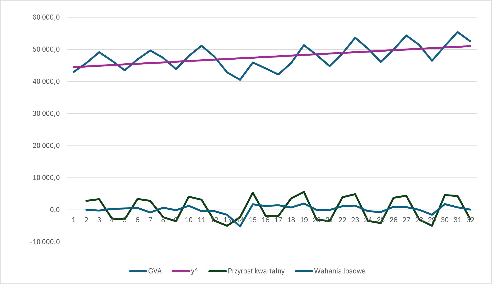
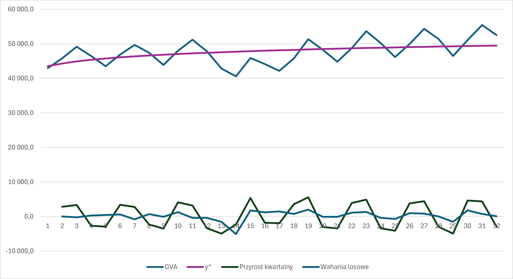
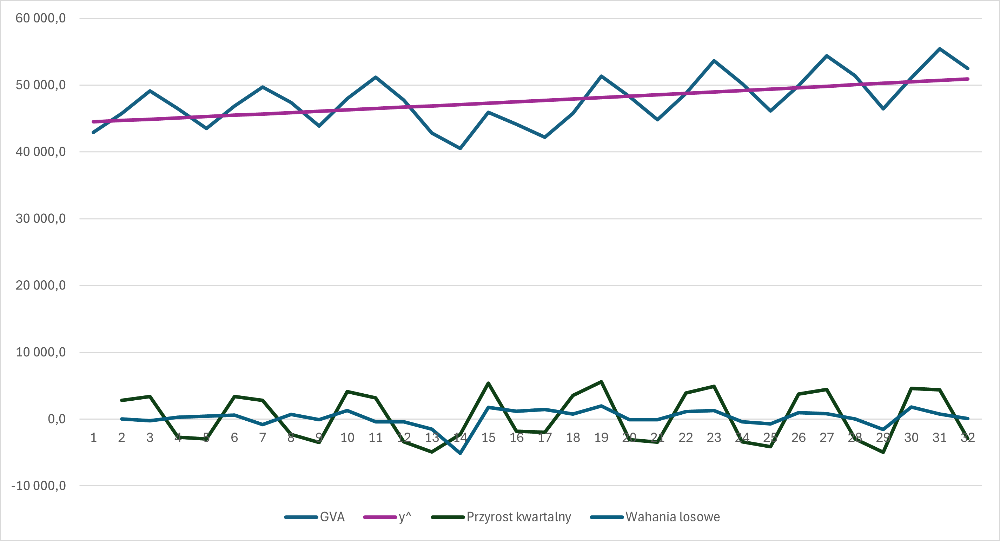

# Analiza wartości dodanej brutto (GVA) dla Grecji - Modele trendu dla cen stałych

### 📋 Opis
Analiza szeregu czasowego wartości dodanej brutto (Gross Value Added - GVA) dla Grecji wyrażonej w cenach stałych. Celem jest porównanie trzech modeli trendu - liniowego, potęgowego i wykładniczego.

## 1. Trend liniowy

### Użyteczne wzory:

#### 1° Specyfikacja modelu 
$$y_t = \beta_0 + \beta_1 \cdot t + \xi_t$$

gdzie:
- $y_t$ - wartość GVA w okresie t
- $t$ - zmienna czasowa (t = 1, 2, 3, ..., T)
- $\beta_0$ - wyraz wolny
- $\beta_1$ - parametr nachylenia (przyrost absolutny GVA na jednostkę czasu)
- $\xi_t$ - składnik losowy

#### 2° Estymowana wartość zmiennej

Wzór na przewidywaną wartość na podstawie dopasowanego modelu.

$$\hat{y}_t = \hat{\beta}_0 + \hat{\beta}_1 t$$

#### 3° Reszty i wariancja reszt

Reszta to różnica między rzeczywistą wartością a przewidywaną:

$$\hat{\varepsilon}_t = y_t - \hat{y}_t$$

Wariancja reszt:

$$\hat{\sigma}^2 = \frac{\sum (y_t - \hat{y}_t)^2}{T - k - 1}$$

gdzie:
- 𝑇 - liczba obserwacji
- 𝑘 - liczba zmiennych objaśniających (tu 1, bo tylko czas)
- 𝑇 − 𝑘 − 1 - stopnie swobody estymacji

#### 4° Szybkość wzrostu

Wskazuje o ile zmienia się wartość zmiennej, gdy czas zmienia się o jedną jednostkę (np. kwartał). Jest to absolutna zmiana, wyrażona w takich samych jednostkach co **y** (np. złotówki, sztuki).

$$\frac{dy_t}{dt} = y'_t = \beta_1$$

#### 5° Tempo wzrostu

Wskazuje jak duża jest zmiana w stosunku do aktualnego poziomu zmiennej. Jest to relatywna zmiana, mówi jak szybko rośnie zmienna procentowo.

$$\frac{\frac{dy_t}{dt}}{y_t} = \frac{\beta_1}{y_t}$$

### 🔧 Metodologia

#### 1. Utworzenie macierzy $\mathbf{X}$

$$\mathbf{X} = \begin{bmatrix} 1 & x_1 \\ 1 & x_2 \\ \vdots & \vdots \\ 1 & x_n \end{bmatrix}$$

* **kolumna 1** – same jedynki $\rightarrow$ odpowiada $\beta_0$ (wyraz wolny),
* **kolumna 2** – wartości zmiennej $x_i, odpowiada numerom kolejnych kwartałów w latach 2017-2024.

#### 2. Macierz $\mathbf{X}^T\mathbf{X}$

* $\mathbf{X}^T$ to **transpozycja macierzy** $\mathbf{X}$, czyli zamiana wierszy na kolumny:

$$\mathbf{X}^T = \begin{bmatrix} 1 & 1 & \cdots & 1 \\ x_1 & x_2 & \cdots & x_n \end{bmatrix}$$

* Mnożenie $\mathbf{X}^T\mathbf{X}$:

$$\mathbf{X}^T\mathbf{X} = \begin{bmatrix} 1 & 1 & \cdots & 1 \\ x_1 & x_2 & \cdots & x_n \end{bmatrix} \begin{bmatrix} 1 & x_1 \\ 1 & x_2 \\ \vdots & \vdots \\ 1 & x_n \end{bmatrix} = \begin{bmatrix} \sum 1 & \sum x_i \\ \sum x_i & \sum x_i^2 \end{bmatrix} = \begin{bmatrix} n & \sum x_i \\ \sum x_i & \sum x_i^2 \end{bmatrix}$$

#### 3. Macierz $\mathbf{X}^T\mathbf{y}$

* $\mathbf{y}$ to **wektor obserwacji**, w tym przypadku jest to wektor wartości GVA w poszczególnych kwartałach:

$$\mathbf{y} = \begin{bmatrix} y_1 \\ y_2 \\ \vdots \\ y_n \end{bmatrix}$$

* Mnożenie $\mathbf{X}^T\mathbf{y}$:

$$\mathbf{X}^T\mathbf{y} = \begin{bmatrix} 1 & 1 & \cdots & 1 \\ x_1 & x_2 & \cdots & x_n \end{bmatrix} \begin{bmatrix} y_1 \\ y_2 \\ \vdots \\ y_n \end{bmatrix} = \begin{bmatrix} \sum y_i \\ \sum x_iy_i \end{bmatrix}$$

#### 4. Oszacowanie współczynników $\beta_0$ oraz $\beta_1$

$$\begin{bmatrix} \hat{\beta}_0 \\ \hat{\beta}_1 \end{bmatrix} = (\mathbf{X}^T\mathbf{X})^{-1}\mathbf{X}^T\mathbf{y}$$

#### 5. Oszacowanie $\hat{y_t}$, czyli trendu

$$\hat{y}_t = \hat{\beta}_0 + \hat{\beta}_1 t$$

#### 6. Obliczenie wariancji

$$\hat{\sigma}^2 = \frac{\sum (y_t - \hat{y}_t)^2}{T - k - 1}$$

gdzie:
- $y_t$ - rzeczywista wartość GVA w cenach stałych
- $\hat{y_t}$ - trend
- 𝑇 − 𝑘 − 1 - w tym przypadku to: 32 - 1 - 1

#### 7. Obliczenie szybkości i tempa wzrostu

$$\frac{dy_t}{dt} = y'_t = \beta_1$$

Szybkość wzrostu jest to po prostu uzyskana z wcześniejszych obliczeń wartość współczynnika $\beta_1$.

$$\frac{\frac{dy_t}{dt}}{y_t} = \frac{\beta_1}{y_t}$$

Tempo wzrostu jest to po prostu szybkość wzrostu podzielona przez średnią wartość GVA.

### 📝 Wyniki

- Wariancja: $\hat{\sigma}^2 = 10245298$ 
- $\hat{\beta_0} \approx 44049.73$
- $\hat{\beta_1} \approx 211.72$

Przeciętnie rzecz biorąc, z kwartału na kwartał wartość dodana brutto (GVA) dla Grecji rosła o 211.72 mln euro.

Przeciętnie rzecz biorąc, z kwartału na kwartał wartość dodana brutto (GVA) dla Grecji rosła o $0.44 \%$.

### 📈 Wizualizacja

## 2. Trend potęgowy

### Użyteczne wzory:

#### 1° Specyfikacja modelu

$$y_t = e^{\beta_0} t^{\beta_1} e^{\xi_t}$$

#### 2° Postać logarytmiczno-liniowa

$$\ln y_t = \beta_0 + \beta_1 \ln t + \xi_t$$

#### 3° Szybkość wzrostu

$$\frac{dy_t}{dt} = e^{\beta_0} \beta_1 t^{\beta_1 - 1} e^{\xi_t} = \beta_1 \underbrace{e^{\beta_0} t^{\beta_1} e^{\xi_t}}_{y_t} t^{-1} = \beta_1 \frac{y_t}{t}$$

więc ostatecznie:

$$\frac{dy_t}{dt} = y'_t = \beta_1 \frac{y_t}{t}$$

#### 4° Tempo wzrostu

$$\frac{\frac{dy_t}{dt}}{y_t} = \frac{\beta_1 \frac{y_t}{t}}{y_t} = \frac{\beta_1}{t}$$

### 🔧 Metodologia

#### 1. Obliczenie dla każdej wartości $ln(gva)$ oraz $ln(t)$

#### 2. Wykorzystanie narzędzia 'Analiza Danych' w Excelu 

Wybrano: Dane -> Analiza danych -> Regresja

Jako zakres wejściowy Y wybrano całą kolumnę z obliczonymi $ln(gva)$.

Jako zakres wejściowy X wybrano całą kolumnę z obliczonymi $ln(t)$.

Otrzymano różne statystyki, w tym również współczynniki $\beta_0$ oraz $\beta_1$, które potem wykorzystano.

#### 3. Oszacowanie $\hat{y_t}$, czyli trendu

$$\hat{y_t} = e^{\hat{\beta_0}} t^{\hat{\beta_1}}$$

#### 4. Obliczenie szybkości i tempa wzrostu

* Szybkość wzrostu

$$\frac{dy_t}{dt} = y'_t = \hat{\beta_1} \frac{y_t}{t}$$

* Tempo wzrostu

$$\frac{\frac{dy_t}{dt}}{y_t} = \frac{\hat{\beta_1}}{t}$$

gdzie:
- $y_t$ - wartość ostatniej obserwacji GVA
- t = 32 - liczba obserwacji

### 📝 Wyniki

- Wariancja: $\hat{\sigma}^2 = 11472148$ 
- $\hat{\beta_0} \approx 10.65$
- $\hat{\beta_1} \approx 0.046$

Przeciętnie rzecz biorąc, z kwartału na kwartał wartość dodana brutto (GVA) dla Grecji rosła o 75.66 mln euro.

Przeciętnie rzecz biorąc, z kwartału na kwartał wartość dodana brutto (GVA) dla Grecji rosła o $0.14 \%$.

### 📈 Wizualizacja

## 3. Trend wykładniczy

### Użyteczne wzory:

#### 1° Specyfikacja modelu

$$y_t = e^{\beta_0 + \beta_1 t + \xi_t}$$

#### 2° Postać logarytmiczno-liniowa

$$\ln y_t = \beta_0 + \beta_1 t + \xi_t$$

#### 3° Szybkość wzrostu

$$\frac{dy_t}{dt} = \underbrace{e^{\beta_0 + \beta_1 t + \xi_t}}_{y_t} \beta_1 = \beta_1 y_t$$

#### 4° Tempo wzrostu

$$\frac{\frac{dy_t}{dt}}{y_t} = \frac{\beta_1 y_t}{y_t} = \beta_1$$

### 🔧 Metodologia

#### 1. Obliczenie dla każdej wartości $ln(gva)$ oraz $ln(t)$

#### 2. Wykorzystanie narzędzia 'Analiza Danych' w Excelu 

Wybrano: Dane -> Analiza danych -> Regresja

Jako zakres wejściowy Y wybrano całą kolumnę z obliczonymi $ln(gva)$.

Jako zakres wejściowy X wybrano całą kolumnę z wartościami $t$.

Otrzymano różne statystyki, w tym również współczynniki $\beta_0$ oraz $\beta_1$, które potem wykorzystano.

#### 3. Oszacowanie $\hat{y_t}$, czyli trendu

$$\hat{y_t} = e^{\hat{\beta_0} + \hat{\beta_1} t}$$

#### 4. Obliczenie szybkości i tempa wzrostu

* Szybkość wzrostu

$$\frac{dy_t}{dt} = \hat{\beta_1} y_t$$

* Tempo wzrostu

$$\frac{\frac{dy_t}{dt}}{y_t} = \hat{\beta_1}$$

gdzie:
- $y_t$ - wartość ostatniej obserwacji GVA

### 📝 Wyniki

- Wariancja: $\hat{\sigma}^2 = 10182325$ 
- $\hat{\beta_0} \approx 10.695$
- $\hat{\beta_1} \approx 0.0043$

Przeciętnie rzecz biorąc, z kwartału na kwartał wartość dodana brutto (GVA) dla Grecji rosła o 228.29 mln euro.

Przeciętnie rzecz biorąc, z kwartału na kwartał wartość dodana brutto (GVA) dla Grecji rosła o $0.43 \%$.

Wariancja reszt dla tego modelu jest najmniejsza, więc model (spośród liniowego, poegowego i wykładniczego) najlepiej pasuje do danych na temat GVA w cenach stałych dla Grecji.
Im mniejsza jest wariancja reszt ($\hat{\sigma}^2$), tym lepiej model (linia trendu) pasuje do danych historycznych.

### 📈 Wizualizacja
