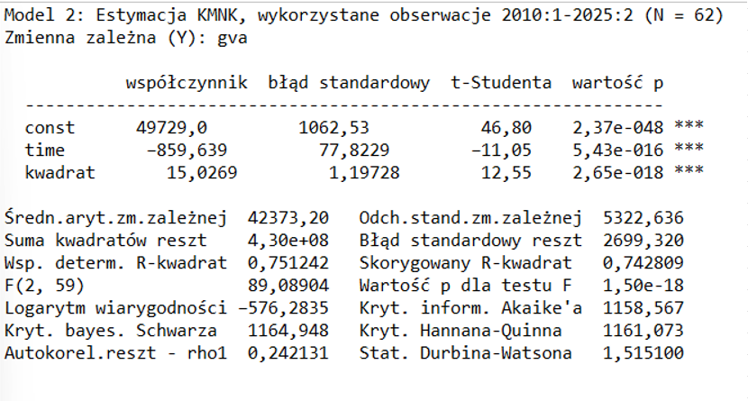
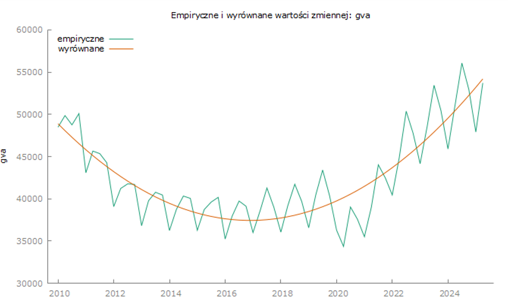
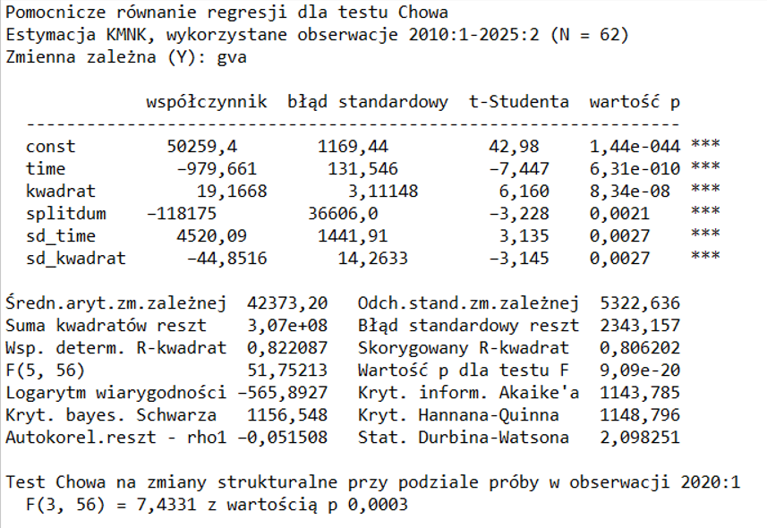
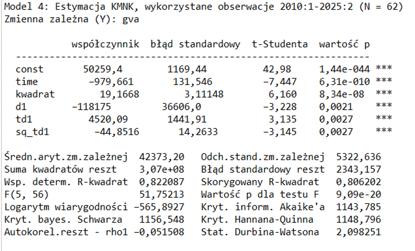
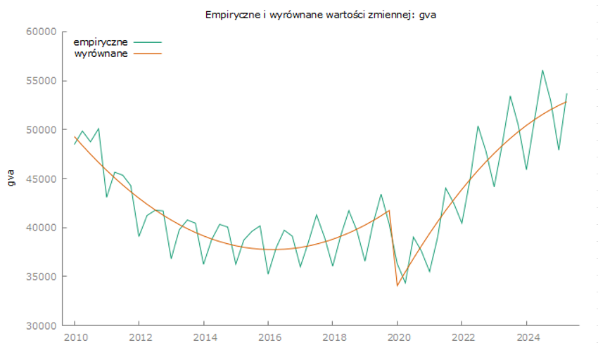
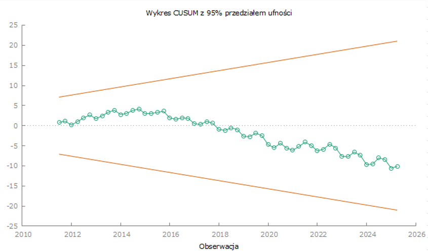

# Analiza wartości dodanej brutto (GVA) dla Grecji - Analiza strukturalnej stabilności trendu GVA Grecji z wykorzystaniem testów Chowa i CUSUM

### 📋 Opis

Niniejsza analiza stanowi kontynuację wcześniejszych badań dotyczących kształtowania się wartości dodanej brutto (GVA - Gross Value Added) w Grecji. Analizując otrzymane wyniki, zdecydowano, że modelem trendu najbardziej pasującym do danych jest **model kwadratowy**.

| Wariant Modelu | Wariancja (Wartość) | Wariancja (Procent) |
| :--- | :--- | :--- |
| wariancja liniowego | 26 294 614 | 360,88% |
| wariancja potęgowego | 28 909 897 | 396,77% |
| wariancja wykładniczego | 26 220 950 | 359,86% |
| **wariancja kwadratowego** | **7 286 330** | **100%** |
| wariancja logistycznego | 26 740 212 | 366,99% |

Głównym celem jest sprawdzenie, czy struktura modelu trendu kwadratowego pozostała stabilna w całym badanym okresie, czy też nastąpiło przełamanie strukturalne w okolicach pierwszego kwartału 2020 roku, które mogłoby być związane z pandemią COVID-19. 

### 🔧 Metodologia

Analiza została przeprowadzona w programie Gretl.

Przedmiotem analizy jest szereg czasowy wartości dodanej brutto (GVA) Grecji w okresie 2010-2025, zawierający dane kwartalne. Dane zostały wcześniej zaimportowane do Gretla.

#### 1. Utworzenie zmiennej czasowej **time**, która przyjmuje kolejne wartości naturalne dla każdej obserwacji (1, 2, 3, ...)

#### 2. Utworzenie zmiennej **kwadrat**, jako kwadrat zmiennej time 

#### 3. Oszacowanie modelu regresji metodą najmniejszych kwadratów (MNK):

$$y_t = \beta_0 + \beta_1·t + \beta_2·t^2 + \xi_t$$

#### 4. Wizualizacja dopasowania modelu (wykres empirycznych i wyrównanych względem czasu)

#### 5. Test Chowa na przełamanie strukturalne

Zweryfikowano hipotezę głoszącą brak zmian strukturalnych w kwartale pierwszym 2020 roku (początek COVID-19).

**Wniosek**: Na poziomie istotności α = 0,05 (a nawet α = 0,001) należy **odrzucić hipotezę zerową** o braku przełamania strukturalnego. Wartość p = 0,0003 dostarcza bardzo silnych dowodów statystycznych na obecność istotnych zmian strukturalnych w pierwszym kwartale 2020 roku.

#### 6. Oszacowanie nowego modelu z uwzględnieniem przełamania strukturalnego

Odrzucenie hipotezy zerowej wymaga **redefiniowania modelu trendu**. Prosty model trendu kwadratowego nie jest wystarczający dla całego okresu 2010-2025, ponieważ nie uwzględnia zmiany struktury zależności, która nastąpiła w 2020 roku.

W celu uwzględnienia przełamania strukturalnego wprowadzono do modelu **zmienne przełącznikowe** (dummy variables) typu 0-1:
- **d1** - zmienna zero-jedynkowa przyjmująca wartość 0 przed 2020:1 i wartość 1 od 2020:1
- **td1** - zmienna interakcyjna `time × d1` pozwalająca na zmianę nachylenia trendu liniowego
- **sq_td1** - zmienna interakcyjna `(time × d1)²` pozwalająca na zmianę krzywizny trendu kwadratowego

Model rozszerzony o te zmienne umożliwia estymację dwóch różnych funkcji trendu kwadratowego: jednej dla okresu przed przełamaniem (2010-2019) i drugiej dla okresu po przełamaniu (2020-2025).

#### 7. Wizualizacja dopasowania modelu (wykres empirycznych i wyrównanych względem czasu)

Model z przełamaniem strukturalnym znacznie lepiej opisuje dane niż prosty model kwadratowy, szczególnie w okresie po 2020 roku, gdzie następuje gwałtowna zmiana kierunku i tempa wzrostu.

#### 8. Test CUSUM

CUSUM = Cumulative Sum of Recursive Residuals (Skumulowana Suma Reszt Rekursywnych)

Test CUSUM jest graficznym testem stabilności strukturalnej parametrów modelu ekonometrycznego, który pozwala wykryć momenty przełamania strukturalnego oraz ocenić, czy parametry modelu pozostają stałe w całym badanym okresie.

Test CUSUM dla Modelu 4 ujawnił brak pełnej stabilności parametrów. Statystyka CUSUM pozostawała w granicach 95% przedziału ufności do około 2023 roku, jednak od 2024 roku wykroczyła poza dolną granicę krytyczną, osiągając wartości około -10 do -11. Oznacza to odrzucenie hipotezy o stabilności parametrów i sugeruje, że model z jednym przełamaniem w 2020:1 może nie wychwytywać dodatkowych zmian strukturalnych występujących w końcowym okresie próby (2024-2025).

#### 9. Analiza wyników

Wstępne wyniki wskazują na istotność wszystkich parametrów występujących przy zmiennych (d1, td1, sq_td1). 

Istotność statystyczna **wszystkich trzech** parametrów przełamania oznacza, że:

- Przełamanie strukturalne w 2020:1 **nie jest tylko przesunięciem poziomu**, ale **kompleksową zmianą dynamiki** GVA
- Zmianie uległy **wszystkie komponenty** funkcji trendu: poziom, tempo wzrostu oraz przyspieszenie/spowolnienie wzrostu
- Model bazowy (bez zmiennych przełącznikowych) był **niewłaściwy** dla całego okresu 2010-2025
- Potwierdza to wyniki testu Chowa, który odrzucił hipotezę o stabilności strukturalnej (F = 7,43, p = 0,0003)

Test CUSUM ujawnił jednak, że model z jednym przełamaniem w 2020:1, choć **statystycznie znacząco lepszy** od modelu bazowego, może nie być w pełni wystarczający dla całego okresu. Wykroczenie statystyki CUSUM poza granice krytyczne w latach 2024-2025 sugeruje możliwość wystąpienia dodatkowych zmian strukturalnych w tym okresie, co wskazuje na potrzebę dalszych badań i ewentualnego rozszerzenia specyfikacji modelu.

#### 10. Obliczanie szybkości wzrostu

**Szybkość wzrostu przed I kwartałem 2020 roku (COVID-19):**

$$\frac{dy_t}{dt} = \beta_1 + 2 \cdot \beta_2 t$$

gdzie: 
- t - średnia arytmetyczna numerów obserwacji (kolejne kwartały) dla lat 2010-2019, w tym przypadku **20.5**

**Szybkość wzrostu po przełamaniu strukturalnym w I kwartale 2020 roku:**

$$\frac{dy_t}{dt} = (\beta_1 + \delta_1) + (2 \cdot (\beta_2 + \delta_2) \cdot t)$$

gdzie: 
- t - średnia arytmetyczna numerów obserwacji (kolejne kwartały) dla lat po starcie pandemii COVID-19, w tym przypadku **51.5**

#### 11. Obliczanie tempa wzrostu

**Tempo wzrostu przed I kwartałem 2020 roku (COVID-19):**

$$\frac{\frac{dy_t}{dt}}{y_t} = \frac{\beta_1 + 2 \cdot \beta_2 t}{y_t}$$

gdzie: 
- t - średnia arytmetyczna numerów obserwacji (kolejne kwartały) dla lat 2010-2019, w tym przypadku **20.5**

- $y_t$ - średnia wartość GVA dla Grecji w latach 2010-2019 (przed pandemią COVID-19)

**Tempo wzrostu po przełamaniu strukturalnym w I kwartale 2020 roku:**

$$\frac{\frac{dy_t}{dt}}{y_t} = \frac{(\beta_1 + \delta_1) + (2 \cdot (\beta_2 + \delta_2) \cdot t)}{y_t}$$

gdzie: 
- t - średnia arytmetyczna numerów obserwacji (kolejne kwartały) dla lat po starcie pandemii COVID-19, w tym przypadku **51.5**

- $y_t$ - średnia wartość GVA dla Grecji w latach 2020-2025 

### 📝 Wyniki

**Otrzymane wartości:**
- $\beta_0 \approx 50259.4$ 
- $\delta_0$ (d1) $\approx -118175$ 
- $\beta_1 \approx -979.66$ 
- $\delta_1$ (td1) $\approx 4520.09$ 
- $\beta_2 \approx 19.17$ 
- $\delta_2$ (sq_td1) $\approx -44.85$ 

Średnia szybkość wzrostu przed początkiem pandemii COVID-19 przypadającej na I kwartał 2020 roku wynosiła $-193.8222$, a więc GVA, z kwartału na kwartał, malała średnio o **$193.82$** milionów euro, co stanowi $0.48 \\%$ średniej kwartalnej GVA.

Średnia szybkość wzrostu po przełamaniu strukturalnym związanym z początkiem pandemii COVID-19 wynosiła $894.8946$, a więc GVA, z kwartału na kwartał, rosła średnio o **$894.89$** milionów euro, co stanowi $1.98 \\%$ średniej kwartalnej GVA.