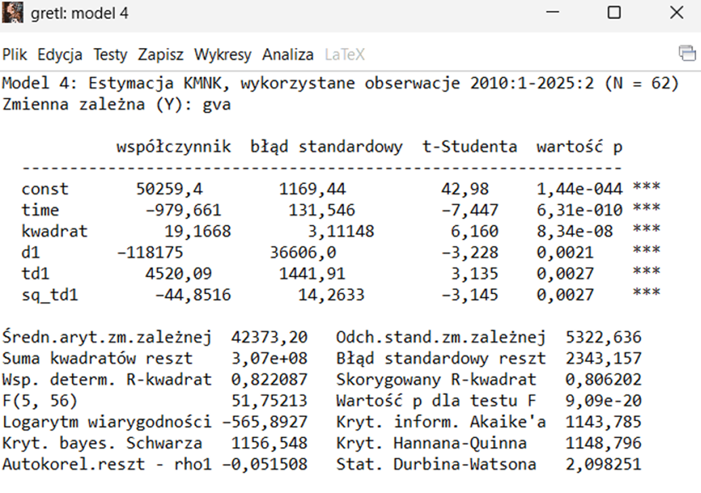
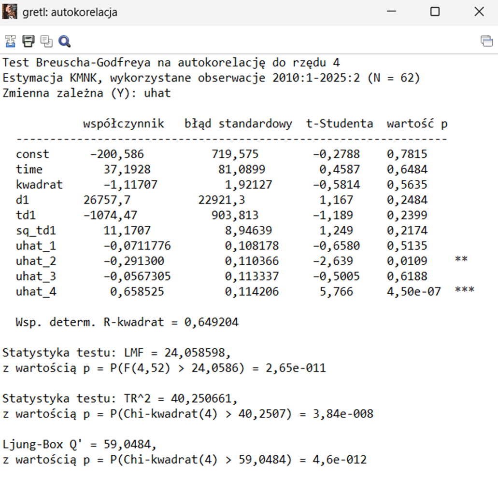
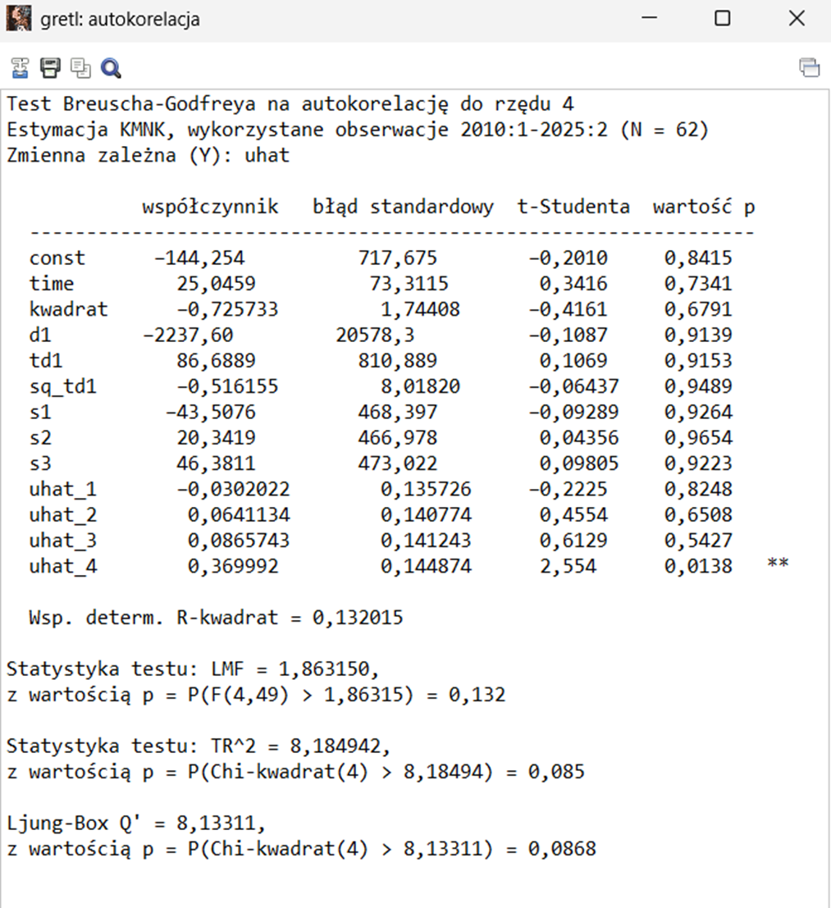
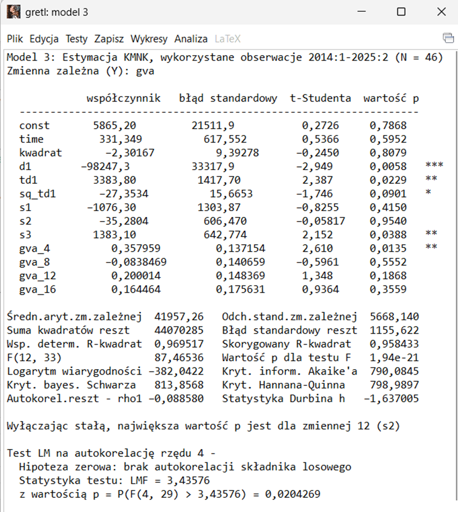
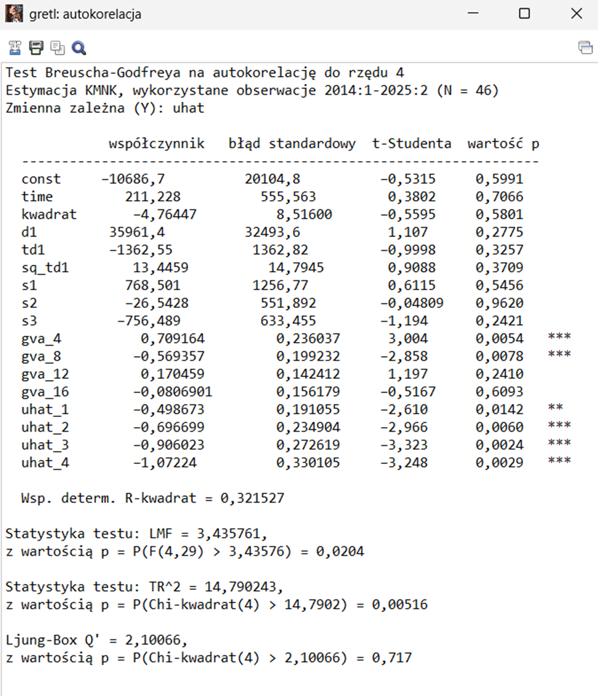
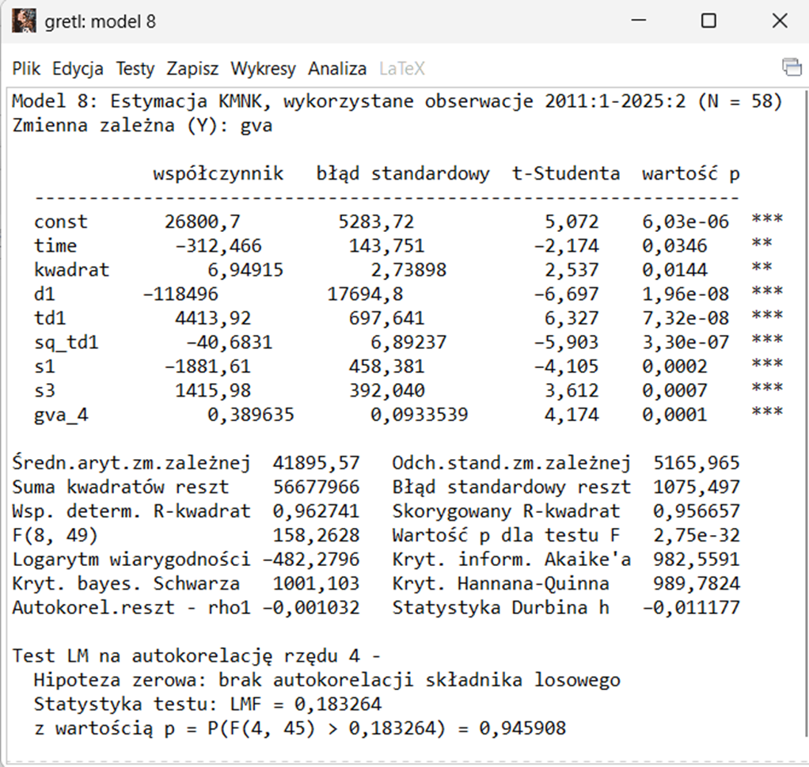
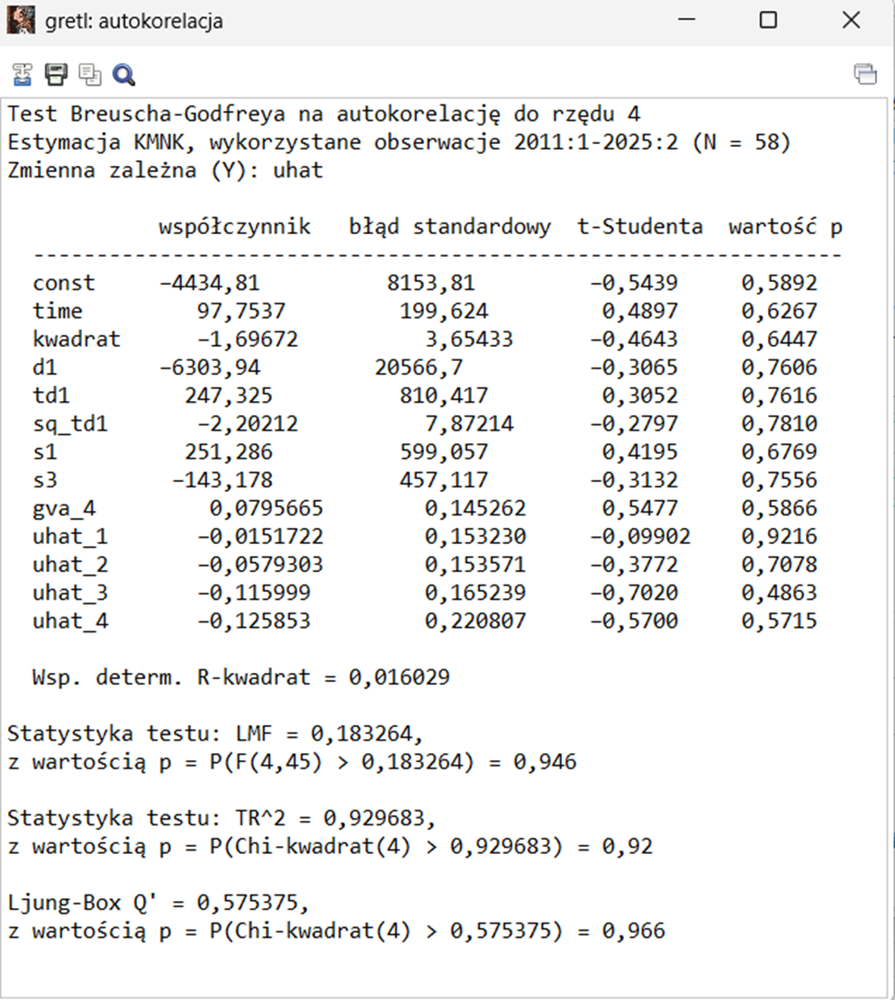
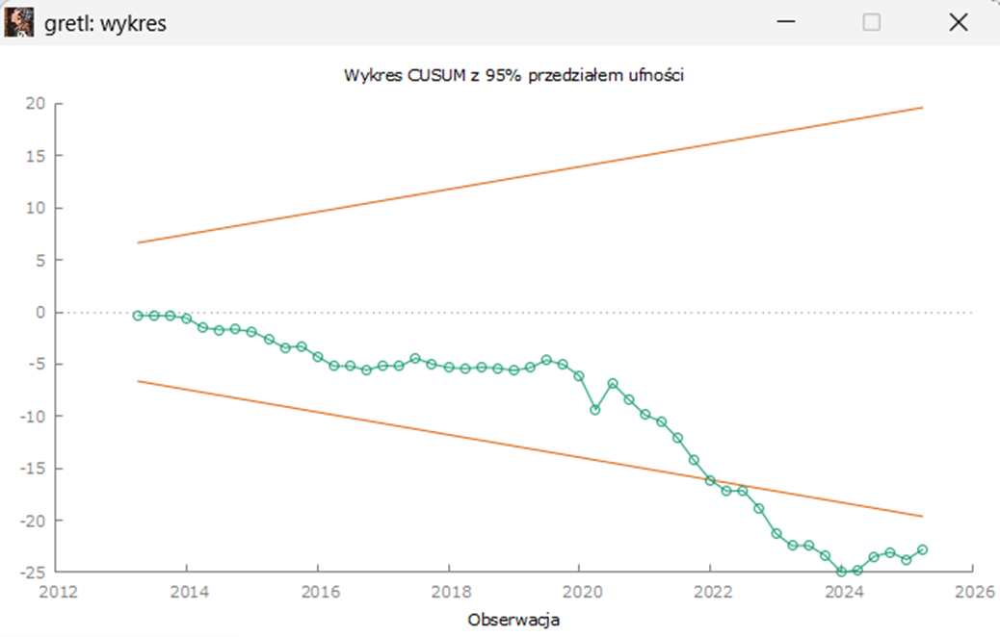

# Analiza wartości dodanej brutto (GVA) dla Grecji - Eliminacja autokorelacji i modelowanie dynamiki szeregu

### 📋 Opis

Kolejny etap prac nad modelem wartości dodanej brutto (GVA) Grecji w latach 2010–2025. Po wybraniu modelu trendu kwadratowego z przełamaniem strukturalnym, głównym celem tej części jest wyeliminowanie autokorelacji składnika losowego. Chodzi o to, aby błędy modelu były od siebie niezależne, co jest kluczowe dla wiarygodności statystycznej. W tym celu przechodzimy od statycznego modelu trendu do modelu dynamicznego, który oprócz zmiennych czasowych uwzględnia także przeszłe wartości GVA (opóźnienia).

### 🔧 Metodologia

#### 1. Zidentyfikowanie "najlepszego" modelu 

Rozpoczęto od "najlepszego" modelu uzyskanego w [Laboratorium 4](lab04/) - jest to model z przełamaniem strukturalnym w pierwszym kwartale 2020 roku (początek pandemii COVID-19). W modelu tym nie ma żadnych mechanizmów modelowania sezonowości, zatem spodziewano się autokorelacji wysokiego rzędu w składniku zakłócającym.

#### 2. Test Breuscha-Godfreya na autokorelację do rzędu 4 dla powyższego modelu

Z powyższego testu wynika, że w składniku zakłócającym występuje autokorelacja rzędu 2. Postawiono tezę, że jest ona skutkiem sezonowości, która nie jest modelowana. Spodziewano się autokorelacji rzędu 1, ta nie występuje, co wstępnie może wskazywać na deterministyczny charakter trendu, czyli taki wynikający z przewidywalnej funkcji czasu, a nie z procesów o charakterze losowym.

#### 3. Dołączenie zmiennych sezonowych do modelu

W Gretlu dodano periodyczne zmienne zero-jedynkowe odpowiadające poszczególnym kwartałom i dodano je do modelu.
Wybrano te odpowiadające I, II i III kwartałowi roku, aby uniknąć doskonałej współliniowości.

#### 4. Test na autokorelację dla modelu ze zmiennymi sezonowymi

Po dołączeniu zmiennych sezonowych otrzymano autokorelację rzędu 4.

Uznano, że prawdopodobnie mamy do czynienia z **sezonowością stochastyczną**.

Do dalszej analizy wybrano powyższy model - model ze zmiennymi sezonowymi.

Ostatnim etapem będzie już faktyczna eliminacja autokorelacji.

#### 5. Wprowadzenie opóźnień 4, 8, 12 i 16 rzędu do modelu

#### 6. Test autokorelacji na tym modelu

Dołączenie tych zmiennych (opóźnień) nie rozwiązało problemu autokorelacji.

#### 7. Redukcja modelu poprzez usunięcie nieistotnych statystycznie zmiennych

Po kolei usuwano z modelu te zmienne, które były najmniej istotne statystycznie - czyli te, gdzie **wartość p** była największa.
Za każdym razem wykonywano test na autokorelację, w celu sprawdzenia czy ta występuje. 

#### 8. Ostateczny model uwzględniający stochastyczny charakter trendu i sezonowości

Wprowadzając opóźnienie rzędu 4 udało się wyeliminować autokorelację.

Uznano, że w ten sposób uwzględniony został stochastyczny charakter trendu i sezonowości.

#### 9. Test CUSUM dla finalnego modelu

Test CUSUM wskazaje na niestabilność wektora parametrów, model, mimo że jest najlepszym jaki udało się uzyskać, nie nadaje się do prognozowania.

### 📝 Wnioski

Udało się stworzyć model, w którym całkowicie wyeliminowano autokorelację, więc błędy są od siebie niezależne. Niestety, test CUSUM pokazał, że parametry modelu są niestabilne w czasie, co prawdopodobnie wynika z gwałtownych zmian w gospodarce Grecji. W praktyce oznacza to, że choć model dobrze opisuje przeszłość, to strach na jego podstawie budować prognozy na przyszłość.
